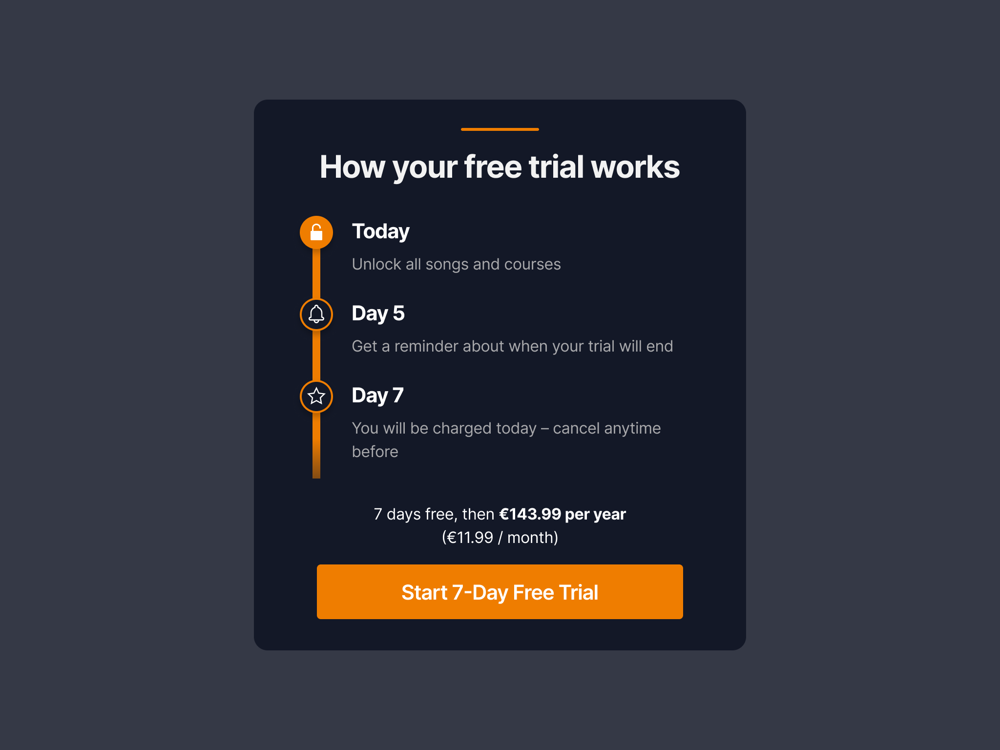

# React UI

## Main Objective

Build this screen from [Figma Design](https://www.figma.com/design/U5kNVKVj1ZSsPnXtlSWckQ/PLG-Code-Challenge?node-id=0-1&m=dev)

Preview:

- Use reusable styles and components where possible
- Responsive layout preferred
- Fetch prices via GraphQL API and format as per user locale

### Optional Objectives

- Add an A/B test that can swap the plan for B variant users instead of a 7-day trial, offer a 14 day trial
- Add a component test that can test that the component displays the offer based on the provided plan/price
